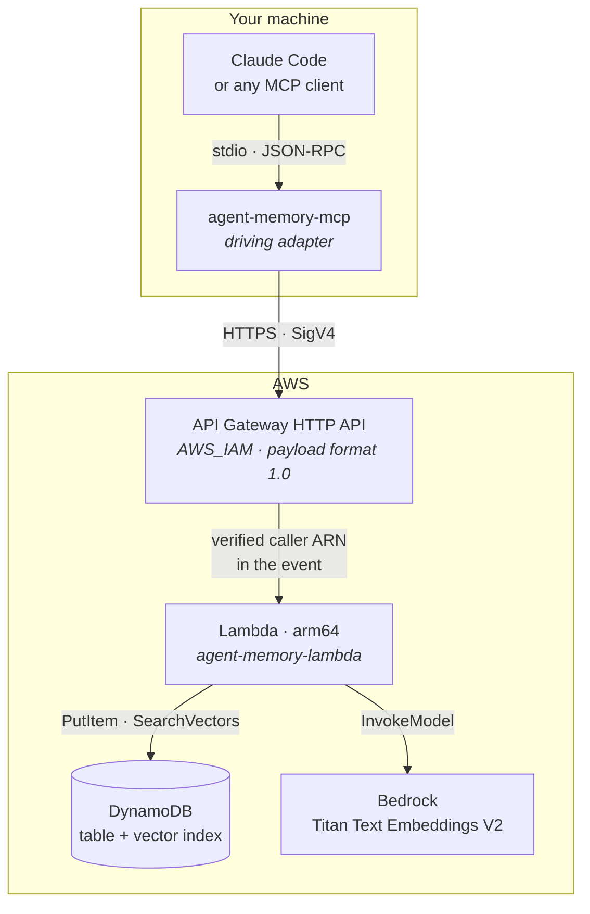

# Semantic memory for AI agents, on DynamoDB vector search

Long-term memory for AI agents, in Rust, built on **Amazon DynamoDB's native
vector search** (GA 2026-08-04) and **Amazon Bedrock Titan Text Embeddings V2**.
It runs as an AWS Lambda behind an API Gateway HTTP API and reaches any agent
through a local **MCP server**.

Ask an agent to remember something in one session and recall it in the next,
searched by meaning rather than keywords — with the vectors living in the same
DynamoDB items as the records themselves.



The MCP server and the Lambda are two **driving adapters** over the same primary
port, `MemoryService`. Neither knows how the other reaches the domain, which is
why the MCP tools are tested against an in-memory fake with no network and no
AWS account.

## Why DynamoDB vector search for this

Storing vectors *in* the operational database beats a dedicated vector store
here for structural reasons, not convenience:

- **The vector and the record are one item.** No Streams → Lambda → external
  store pipeline, no dual writes, no divergence. One `PutItem` stores and
  indexes.
- **Per-user isolation is the table's own primary key.** `user_id` is both the
  table partition key and the vector index `HASH`, so a search scans one
  person's vectors — and cross-user leakage is designed out rather than guarded
  against.
- **That same choice is the biggest cost lever in the system**, because vector
  search is billed per byte *processed*.
- **TTL is the forgetting mechanism.** Deleting an item removes its vector index
  entry too. No compaction job.

The full reasoning, including what this design deliberately does *not* claim, is
in [docs/architecture.md](docs/architecture.md) and [docs/cost.md](docs/cost.md).

## Quick start

```bash
make check          # fmt, clippy -D warnings, 75 unit tests. No AWS, no cost.
make build          # cargo lambda build --release --arm64
make deploy         # terraform apply
make smoke          # store and recall one memory through the deployed API
make mcp-config     # emit the .mcp.json block, wired to the deployed endpoint
make destroy
```

Paste the `make mcp-config` output into `.mcp.json`, restart your MCP client,
and try *"remember that I prefer pour-over coffee, no sugar"* — then, in a fresh
session, *"what coffee do I like?"*.

Prerequisites (`cargo-lambda`, **`zig`**, Terraform, Bedrock model access) are in
[docs/deployment.md](docs/deployment.md). `make preflight` checks the build
tooling and explains what is missing.

## Repository layout

A Cargo workspace split so the **compiler** enforces the hexagonal dependency
rule: `agent-memory-core` is a crate that does not depend on an AWS SDK, so an
accidental import fails the build rather than quietly eroding the boundary.

| Crate | Role | Depends on |
|---|---|---|
| `agent-memory-core` | Domain: model, ports, use cases | *nothing* |
| `agent-memory-contract` | Wire DTOs shared by server and client | serde |
| `agent-memory-aws` | Driven adapters: DynamoDB, Bedrock | core |
| `agent-memory-client` | `MemoryService` over HTTP + SigV4 | core, contract |
| `agent-memory-lambda` | Driving adapter: the HTTP API | core, contract, aws |
| `agent-memory-mcp` | Driving adapter: MCP over stdio | core, client |

## The Claude Code plugin

Three tools is the right size for a protocol surface and not enough to get good
memory behaviour: left alone, an agent recalls every turn — an embedding plus a
billed vector search each time — stores conversational debris that crowds out
signal, and cannot answer *"what do you know about me?"* at all, because the API
has no list endpoint.

[`plugins/agent-memory`](plugins/agent-memory/README.md) is the layer that
supplies that judgement: skills for curation, recall strategy, auditing, ops and
contributing; agents that curate a session, audit the store, and review a diff
against this repo's architectural invariants; and a hook that journals every
write locally so the store can be audited despite having no list endpoint.

```
/plugin marketplace add .
/plugin install agent-memory@agent-memory
/memory-setup
```

## Documentation

| Document | What it covers |
|---|---|
| [Architecture](docs/architecture.md) | The hexagon, ports and adapters, why the crate split is load-bearing, request flow |
| [Vector search](docs/vector-search.md) | The three API details that decide whether this works, data model, limits, gotchas |
| [Identity](docs/identity.md) | SigV4, why the `gh` token is not used, payload format 1.0, ARN normalisation |
| [Cost](docs/cost.md) | Verified pricing, why HTTP APIs, and where the money actually goes |
| [Deployment](docs/deployment.md) | Prerequisites, Terraform, the vector-index escape hatch, IAM |
| [MCP server](docs/mcp.md) | Tools, wiring it to a client, why tool descriptions are prompts |
| [Claude Code plugin](plugins/agent-memory/README.md) | Skills, agents, commands and the write journal layered over the MCP tools |
| [Testing](docs/testing.md) | What runs for free, what costs money, and the two open verifications |

## Status

Everything builds and passes locally: `clippy -D warnings` clean, 75 unit tests,
`terraform validate` clean, and the MCP server answers a real JSON-RPC handshake.

Two things still need a live AWS account to confirm; both have documented
fallbacks and are tracked in [docs/testing.md](docs/testing.md#open-verifications).

## References

- [Using vector indexes in DynamoDB](https://docs.aws.amazon.com/amazondynamodb/latest/developerguide/VectorSearch.html)
- [Creating and searching vector indexes](https://docs.aws.amazon.com/amazondynamodb/latest/developerguide/VectorSearchWorkingWith.html)
- [`aws-sdk-dynamodb` 1.120](https://docs.rs/aws-sdk-dynamodb/1.120.0/aws_sdk_dynamodb/)
- [Model Context Protocol Rust SDK](https://github.com/modelcontextprotocol/rust-sdk)

## License

MIT
