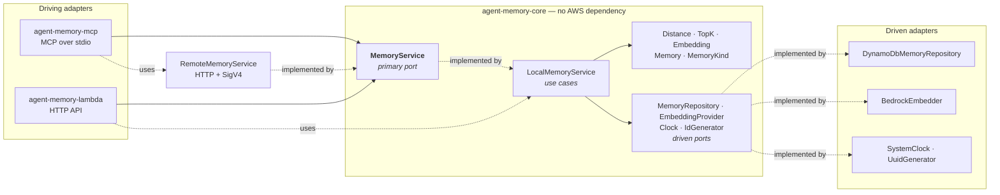
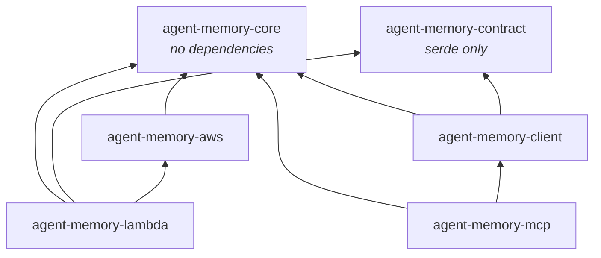
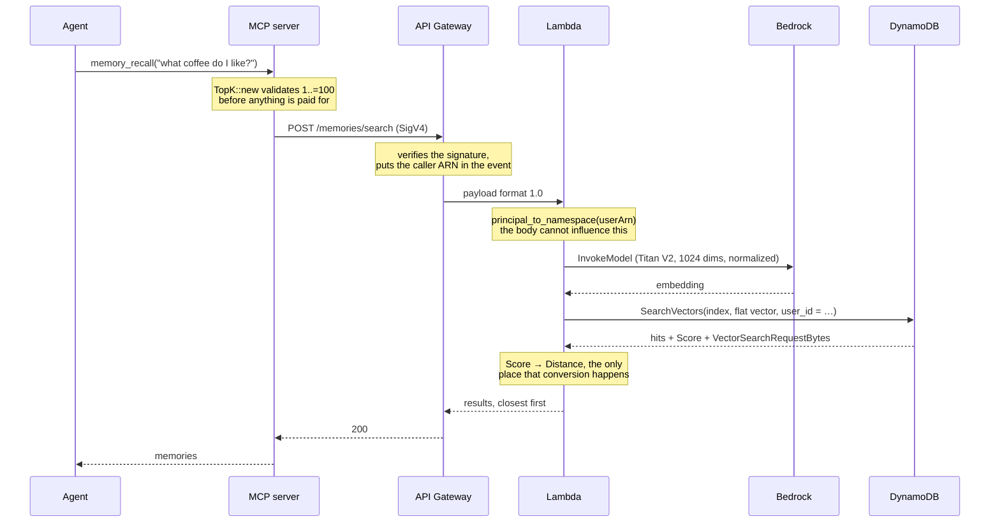

# Architecture

Ports and adapters, with the boundary enforced by the compiler rather than by
convention.

## The hexagon

The unusual part is that **`MemoryService` has two implementations**, and that
is the whole point:

| Implementation | Runs in | How it satisfies the port |
|---|---|---|
| `LocalMemoryService` | the Lambda | orchestrates use cases over the driven ports |
| `RemoteMemoryService` | the MCP server | HTTP + SigV4 to the deployed API |

The MCP tools depend only on the trait. Swapping the implementation turns the
same MCP binary into one that talks to DynamoDB directly — useful for debugging
— with no change to the tool code. It is also why the tools are tested against
an in-memory fake with no network at all.

## The dependency rule is a build error

These are separate crates rather than modules on purpose. A module boundary is a
convention that erodes under deadline pressure; a crate boundary means
`use aws_sdk_dynamodb::…` inside the domain does not compile.

`agent-memory-contract` sits apart from both the domain and the transports so
that the Lambda and the HTTP client cannot drift: a renamed field is a compile
error on the other side, not a deserialisation failure discovered in production.

## What the domain types are for

Three vector-search mistakes are made unrepresentable rather than merely
documented. Each is explained in detail in
[vector-search.md](vector-search.md#three-api-details-that-decide-whether-this-works):

| Type | Prevents |
|---|---|
| `Distance` — `Ord` sorts ascending | Sorting a `COSINE` score the wrong way round |
| `TopK` — validates `1..=100` | Paying for an embedding, then failing on a hard quota |
| `Embedding` — rejects NaN/Inf | A value DynamoDB's `N` type cannot represent |

`Clock` and `IdGenerator` are ports for a narrower reason: without them,
`created_at`, `expires_at` and UUIDs make every use-case test non-deterministic.

### One deliberate leak

`TopK`'s `1..=100` bound is a DynamoDB quota, not a domain rule, and it lives in
the domain anyway. The alternative — discovering it in the adapter — means the
caller has already paid Bedrock for an embedding before the request is rejected.
The leak is documented in the type's rustdoc.

## Request flow

`recall` is the hot path: it runs on every agent turn that consults memory.

Two details worth noticing in that sequence:

- The namespace is derived **after** the signature is verified and **never**
  read from the body. See [identity.md](identity.md).
- `VectorSearchRequestBytes` comes back on every search and is logged as a
  structured `tracing` field, because it is the number that predicts the bill.
  See [cost.md](cost.md).

## Composition roots

Each binary wires the layers in exactly one place:

- `agent-memory-lambda/src/main.rs` builds the SDK clients **once, outside the
  handler**, so connection pools and the credential cache survive across
  invocations instead of being rebuilt per request.
- `agent-memory-mcp/src/main.rs` builds the HTTP client and points it at
  `AGENT_MEMORY_API`.

## A note on the MCP tool surface

`#[tool_router]` cannot be applied to a generic `impl`, so `MemoryTools` holds
`Arc<dyn MemoryService>` rather than being monomorphised over the port. The
abstraction is unchanged — it still accepts any implementation — and the dynamic
call is immaterial next to the network round trip it wraps.
