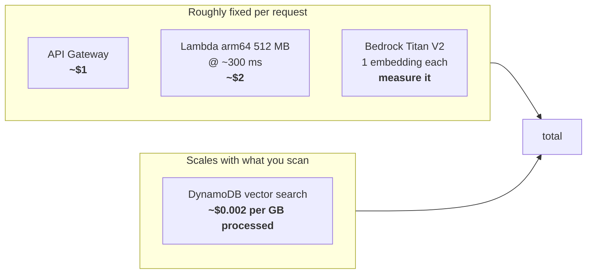
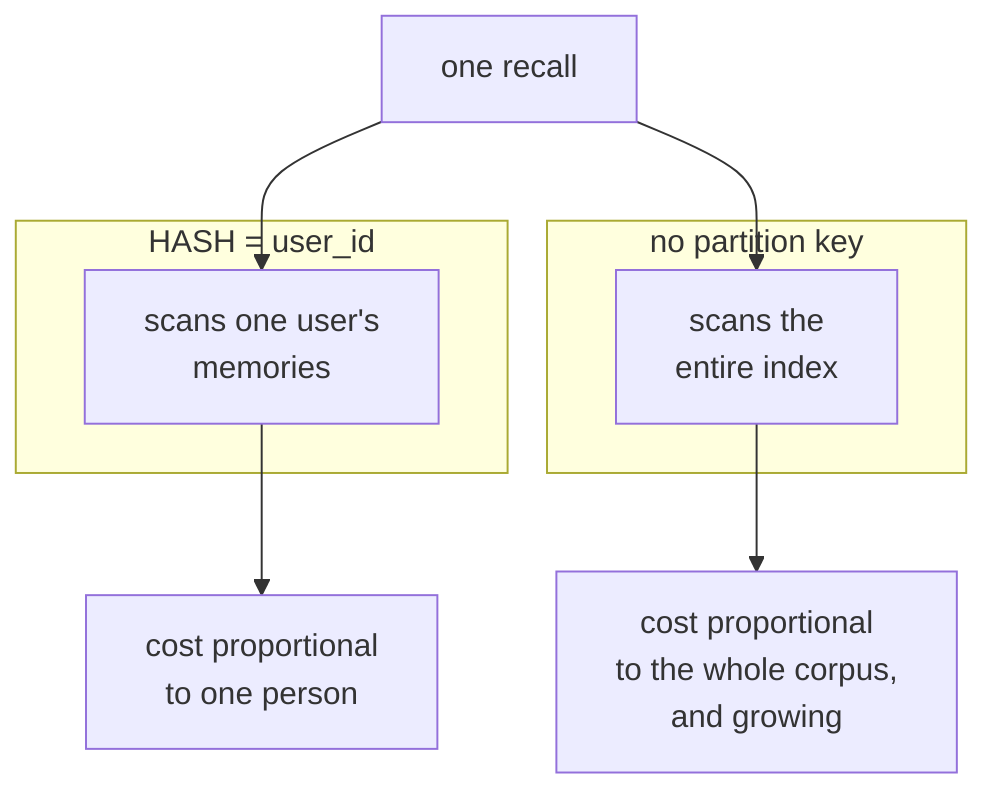

# Cost

The short version: **the API Gateway is the cheapest line on the bill, and the
partition key is the most expensive decision.**

## Why an HTTP API

Verified prices, us-east-1:

| Option | Price | Verdict |
|---|---|---|
| **API Gateway HTTP API** | **$1.00 / million** requests (first 300M, then $0.90) | chosen |
| API Gateway REST API | $3.50 / million | 3.5× more, no benefit here |
| Lambda Function URL | $0 | cheaper still, but not an API Gateway |

Free tier: 1M calls/month for 12 months. Data out: $0.09/GB.

HTTP APIs are cheaper because they carry less. They support everything this
design uses and nothing it does not:

| Feature | HTTP API | REST API |
|---|---|---|
| IAM authorization | yes | yes |
| JWT authorizer | yes | no |
| Lambda authorizer | yes | yes |
| **API keys / usage plans** | **no** | yes |
| Per-client throttling | no | yes |
| Response caching | no | yes |
| AWS WAF | no | yes |
| X-Ray tracing | no | yes |
| Execution logs | no | yes |

The missing feature that shaped the design is **API keys**: HTTP APIs have none.
That rules out the usual "hand the client a key" pattern and pushes toward IAM —
which happens to be both free and the right answer for a local MCP server that
already has AWS credentials. See [identity.md](identity.md).

Other levers applied: `$default` stage with auto-deploy (no charge), **access
logs off by default** (CloudWatch Logs bills ingestion; `enable_access_logs`
turns them on), no custom domain, no WAF.

## Where the money actually goes

Roughly, per million `recall` operations:



Vector search is billed **per byte processed**, and the partition key decides
how many bytes each query touches:



With ten thousand users, the second column is four orders of magnitude worse for
the same query — and it gets worse as the corpus grows, while the first column
does not. **The biggest cost decision in this system lives in the `SearchSchema`,
not in the gateway.**

The same partition key also determines throughput, because the 1 GBps search and
10 MBps write quotas are enforced *per partition key value*. Capacity therefore
grows with the number of users instead of being shared across them.

## Measuring it

Every search logs the number that drives the bill:

```rust
tracing::info!(
    vector_search_request_bytes = bytes,
    index = %self.index_name,
    top_k = query.top_k.get(),
    "vector search completed"
);
```

`VectorSearchRequestBytes` comes back on every `SearchVectors` response when
`ReturnConsumedCapacity` is set, and lands in CloudWatch Logs. From there:

```
fields @timestamp, vector_search_request_bytes, top_k
| filter ispresent(vector_search_request_bytes)
| stats avg(vector_search_request_bytes), max(vector_search_request_bytes), count() by bin(1h)
```

It is deliberately logged rather than returned in the API response: surfacing it
would mean threading an infrastructure metric through the domain port, and
CloudWatch is where cost analysis actually happens.

## Vector index rates

Inferred from the worked example on the AWS DynamoDB pricing page, us-east-1 —
worth confirming against your own bill rather than trusting these:

| Dimension | Rate |
|---|---|
| Vector writes | ~$0.52 / GB |
| Vector search | ~$0.002 / GB processed |
| Vector index storage | ~$0.25 / GB-month |

With a **1 KB minimum billable size for both writes and searches**. For small
memories that minimum, not the actual size, is what you pay.

## Keeping the demo cheap

- The integration tests are `#[ignore]`d *and* gated on `DDB_VECTOR_IT=1`, so
  `make test` never touches AWS.
- `make smoke` stores its memory with a one-hour TTL, so a run leaves nothing
  behind even if the cleanup step never happens.
- Storage is billed for as long as the index exists, whether or not it is
  queried. `make destroy` when you are done.
