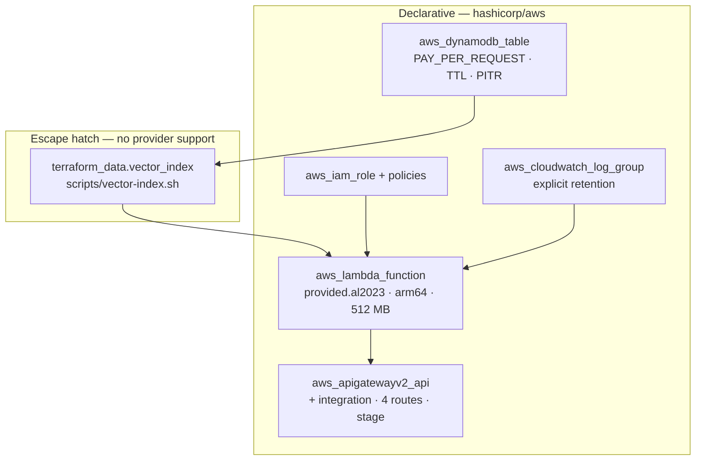

# Deployment

## Prerequisites

| Tool | Why |
|---|---|
| Rust 1.95 | pinned by `rust-toolchain.toml` |
| `cargo-lambda` | `cargo install cargo-lambda` |
| **`zig`** | `pip3 install ziglang` — see below |
| Terraform ≥ 1.9 | the stack |
| AWS CLI + `jq` | used by the vector-index script |
| Bedrock model access | `amazon.titan-embed-text-v2:0`, enabled **in the target region** |

`make preflight` checks the build tooling and explains what is missing.

**`zig` is not optional.** `cargo-lambda` cross-compiles through
`cargo-zigbuild`. A natively linked binary picks up the build machine's glibc,
which is newer than Amazon Linux 2023's, and the function then dies at runtime
with a GLIBC version error that says nothing about the cause. zigbuild pins the
target glibc.

**Region choice matters.** Bedrock model availability is narrower than
DynamoDB's, so pick a region that offers both, and enable the model there before
deploying.

## Make targets

```bash
make check          # fmt, clippy -D warnings, 75 unit tests. No AWS, no cost.
make build          # cargo lambda build --release --arm64 --output-format zip
make build-mcp      # the local MCP server binary
make plan           # terraform plan
make deploy         # terraform apply (runs `build` first)
make smoke          # store and recall one memory through the deployed API
make mcp-config     # emit the .mcp.json block wired to the deployed endpoint
make test-it        # integration tests against real AWS — creates resources, costs money
make destroy
```

## What gets created



The Lambda `depends_on` the vector index, so the function never goes live before
the index can answer a search.

The log group is created **explicitly** rather than left to the Lambda service,
which would create one with no expiry and outside Terraform's control.

## The vector-index escape hatch

DynamoDB vector search has **no infrastructure-as-code support anywhere** as of
this writing:

| Path | Vector index support |
|---|---|
| `hashicorp/aws` 6.58 — `aws_dynamodb_table` | none |
| CloudFormation `AWS::DynamoDB::Table` | no `VectorIndexes` property |
| `awscc_dynamodb_table` 1.96 | none — generated from the CloudFormation schema |

So everything that *can* be declarative is: the table, TTL, PITR, tags, the API,
the Lambda, IAM, log groups and the destroy lifecycle. Only the index itself goes
through `terraform_data` plus `terraform/scripts/vector-index.sh`, isolated in
one place so it can be deleted wholesale once a provider catches up.

Three consequences that are easy to trip over:

**`kind` is not declared on `aws_dynamodb_table`.** The provider runs a
CustomizeDiff that fails the plan with *"all attributes must be indexed"* for any
attribute no key or secondary index references — and it cannot see vector
indexes at all. The script registers the attribute through `UpdateTable`
instead.

**`lifecycle { ignore_changes = [attribute] }` is required.** Once the script has
added `kind` to the table's `AttributeDefinitions`, the next plan would see an
attribute Terraform did not declare and try to remove it — which would break the
vector index.

**The destroy provisioner captures everything in `triggers_replace`**, because a
destroy-time provisioner may only reference `self`. Values cannot be read from
variables at that point.

### Ordering on destroy

`terraform_data.vector_index` depends on the table, so on destroy it runs
**first**. That is also what avoids `DeleteTable` failing with
`ResourceInUseException: Cannot delete table while indexes are being created,
updated, or deleted`. The script waits for the deletion to complete before
returning.

### Idempotency

`vector-index.sh create` checks whether the index already exists and converges on
its readiness rather than erroring, so a re-apply after a partial failure works.
Both paths poll for `IndexStatus == ACTIVE && Backfilling != true`, because
[there is no AWS waiter for index readiness](vector-search.md#gotchas).

## IAM

`dynamodb:SearchVectors` is a **new action**, and the resource is the *index*
ARN rather than the table's. Pre-existing read policies do not grant it:

```hcl
statement {
  actions   = ["dynamodb:SearchVectors"]
  resources = ["${aws_dynamodb_table.memories.arn}/index/MemoryIndex"]
}
```

The execution role also gets `PutItem`/`GetItem`/`DeleteItem`/`BatchWriteItem` on
the table, and `bedrock:InvokeModel` scoped to the single model in use rather
than every foundation model.

For caller policies — including the read-only variant — see
[identity.md](identity.md#granting-access).

## Configuration

| Variable | Default | Notes |
|---|---|---|
| `region` | `us-east-1` | must offer both DynamoDB vector search and the model |
| `embedding_dimensions` | `1024` | **cannot be changed after the index exists** |
| `embedding_model_id` | `amazon.titan-embed-text-v2:0` | must match the dimension |
| `lambda_memory_mb` | `512` | CPU scales with this; it governs cold start too |
| `lambda_timeout_seconds` | `30` | a Bedrock call sits on the request path |
| `log_retention_days` | `14` | |
| `enable_access_logs` | `false` | CloudWatch Logs bills ingestion |

Changing `embedding_dimensions` or the distance function after the fact requires
deleting and recreating the index, and re-embedding every memory.

## No VPC, on purpose

There is no `vpc_config` anywhere in this stack. `SearchVectors` resolves to a
dedicated endpoint (`search-dynamodb.<region>.amazonaws.com`) separate from the
regular DynamoDB one, so inside a VPC that hostname needs its own egress path.
The symptom of missing it is that writes succeed and only search fails.

If you do need a VPC, allow both hostnames and never set `endpoint_url`, which
breaks search routing rather than helping.
