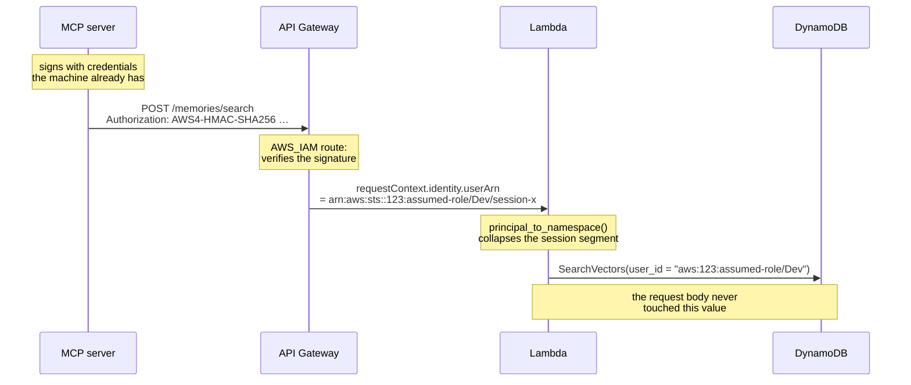
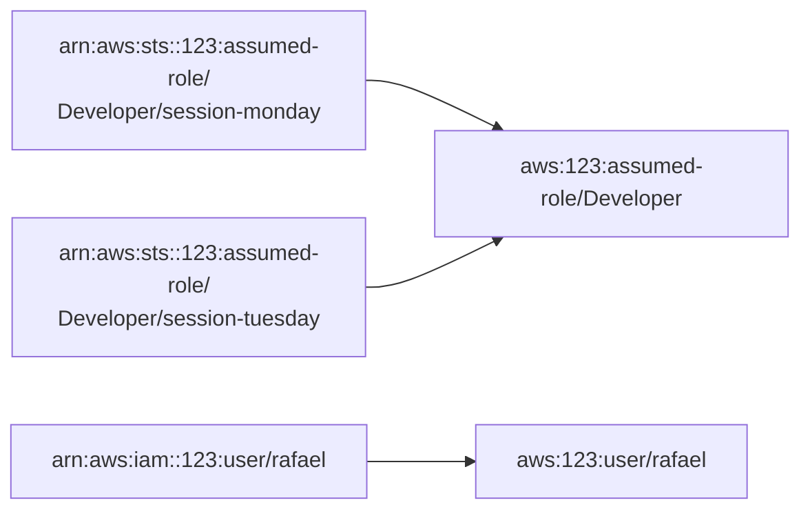

# Identity

**Authentication is SigV4. The memory namespace is derived server-side from the
verified IAM principal, and is never read from the request body.**

The wire contract has no `user_id` field at all. A client that sends one anyway
is ignored — there is a test named
`a_user_id_in_the_body_is_ignored_rather_than_honoured` that asserts exactly
that.



## Why the local `gh` token is not used for authentication

A reasonable-sounding alternative is to send the local GitHub token and have a
Lambda authorizer verify it. This project deliberately does not.

A token from `gh auth login` typically carries these scopes:

```
gist, read:org, repo, workflow
```

`repo` is read/write access to **every** repository the user can reach, and
`workflow` can trigger Actions. Forwarding that to this API would hand it — and
its CloudWatch logs, and anyone who later compromised the account — that entire
blast radius, in exchange for answering the question "who are you".

SigV4 already answers that question, with credentials the machine has anyway, at
no extra cost and with no secret to distribute. So:

- **the GitHub token is never read and never transmitted**;
- the MCP server calls `gh api user` — not `gh auth token` — purely to attach a
  display name to stored memories;
- `github_login` is attribution metadata and takes no part in authorization.

If you ever *do* want GitHub to be the identity provider, the right shape is a
dedicated OAuth App with `read:user` scope obtained through the device flow,
verified by a Lambda authorizer with caching. Not the CLI's token.

### If GitHub identity is ever promoted to a namespace

Use the numeric `id`, never the `login`. Logins can be renamed, and the old name
is then free for someone else to register — which would drop a stranger into
another user's namespace.

## Payload format 1.0 is load-bearing

The API Gateway integration is pinned to payload format **1.0**. This is not a
legacy leftover.

| | Format 1.0 | Format 2.0 |
|---|---|---|
| `requestContext.identity` | present | **absent** |
| `identity.userArn` | populated on IAM routes | — |
| `requestContext.authorizer` | — | `jwt` only |

Under format 2.0 a function behind an `AWS_IAM` route has **no way to learn who
called it**. Switching `payload_format_version` to `"2.0"` makes every request
fail closed with `401 unidentified_caller` — which is the correct behaviour for
a misconfiguration, and is itself tested.

An alternative was considered and rejected: keep 2.0 and inject
`$context.identity.userArn` into a header with parameter mapping.

```hcl
request_parameters = {
  "overwrite:header.x-memory-principal" = "$context.identity.userArn"
}
```

The mechanism does exist and `$context.*` is a valid mapping source. `overwrite:`
rather than `append:` matters, because `append:` would concatenate a
client-supplied value and let the header be spoofed. It was not chosen because
every official example of parameter mapping uses `HTTP_PROXY`, and support for
`AWS_PROXY` integrations is unconfirmed. It remains the documented fallback.

## Normalising the caller ARN

IAM caller ARNs are normalised before use, because assumed-role ARNs end in a
**session name that changes on every login**:



Without collapsing that segment, every SSO login would open a brand-new
namespace and the previous day's memories would appear to have vanished — a
failure that looks like data loss and is not.

The partition is kept as the namespace prefix (`aws:`, `aws-cn:`, …) because
account IDs are only guaranteed unique *within* a partition.

Malformed ARNs are rejected rather than producing a junk namespace, and an
absent identity is reported as `401` rather than `400` — with `AWS_IAM` on the
route, a request with no identity means the gateway is not passing through what
we expect, which is an authentication problem and not a client mistake.

## What this is and is not

The namespace is a **real security boundary at the API**: no request can reach
another user's memories, whatever it puts in its body.

It is **not** a boundary at the database. Anyone holding
`dynamodb:SearchVectors` on the index bypasses the API entirely and can search
any namespace. Fine-grained access control condition keys such as
`dynamodb:LeadingKeys` do **not** apply to `SearchVectors`, so this cannot be
tightened at the IAM policy level either.

Strict tenant isolation at the data layer needs separate tables with separate
grants.

## Granting access

Because the API is split into four routes rather than one catch-all, callers can
be granted asymmetric access. Terraform emits both policies:

| Output | Grants |
|---|---|
| `caller_policy_arn` | store, search, read and delete |
| `caller_read_only_policy_arn` | search and read only |

The read-only variant is what you attach to an agent that should be able to
consult memory but never write to or delete it — an option a single-route API
could not express.
