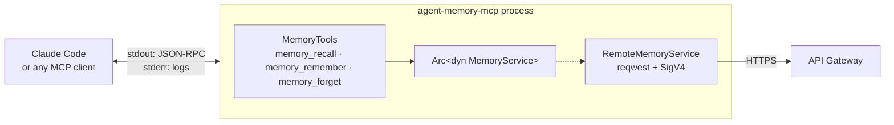

# MCP server

A local stdio MCP server that gives any MCP-capable agent long-term memory.
Built on [`rmcp`](https://github.com/modelcontextprotocol/rust-sdk) 3.1.



## Wiring it up

```bash
make build-mcp
make mcp-config     # prints the block below, filled in from terraform outputs
```

```json
{
  "mcpServers": {
    "agent-memory": {
      "command": "/path/to/target/release/agent-memory-mcp",
      "env": {
        "AGENT_MEMORY_API": "https://xxxx.execute-api.us-east-1.amazonaws.com",
        "AWS_REGION": "us-east-1"
      }
    }
  }
}
```

Paste it into `.mcp.json` and restart the client. No secret is involved: the
server signs with whatever AWS credentials the machine already has.

Verify it standalone without a client:

```bash
printf '%s\n' \
  '{"jsonrpc":"2.0","id":1,"method":"initialize","params":{"protocolVersion":"2025-06-18","capabilities":{},"clientInfo":{"name":"probe","version":"1"}}}' \
  '{"jsonrpc":"2.0","method":"notifications/initialized"}' \
  '{"jsonrpc":"2.0","id":2,"method":"tools/list"}' \
| AGENT_MEMORY_API=https://example.invalid AWS_REGION=us-east-1 \
  ./target/release/agent-memory-mcp 2>/dev/null
```

## Tools

| Tool | Arguments |
|---|---|
| `memory_recall` | `query`, `top_k?`, `kind?`, `max_distance?` |
| `memory_remember` | `text`, `kind?`, `ttl_seconds?` |
| `memory_forget` | `memory_id` |

**No tool takes a `user_id`.** Identity comes from the signed request, so an
argument the model could set would be an argument the model could get wrong —
and a privilege escalation. There is a test asserting no schema mentions it.

`kind` is one of `fact`, `preference` or `episode`, and maps to the vector
index's `INLINE_FILTER` so narrowing happens at the storage layer.

`max_distance` is an **upper** bound: distance is 0 for an exact match and grows
as relevance drops, so a smaller number is stricter. See
[vector-search.md](vector-search.md#2-cosine-means-lower-is-better).

## Tool descriptions are prompts

The `description` strings are not documentation for humans — they are what the
model reads to decide whether to call a tool. Each one therefore says when *not*
to call as well as when to:

> Search the user's long-term memory by meaning. Call this before answering
> whenever the user's own preferences, past decisions, projects or personal
> facts could change the answer […] **Do not call it for general knowledge
> questions** that any answer would be the same for.

Without that hedge an agent tends to recall on every turn, and each recall costs
a Bedrock embedding plus a billed vector search. There is a test that fails if a
tool description stops telling the model when to hold back.

`memory_remember` carries the corresponding guard: store durable information,
**not** transient conversation context, anything the user asked to keep private,
or secrets.

The server also sets `instructions` in its `initialize` response, which the
client surfaces as context — the right place for guidance that does not fit in a
single tool description.

## stdout belongs to JSON-RPC

A stray `println!` corrupts the protocol stream, and the resulting failure looks
nothing like its cause. Every diagnostic goes to stderr, and the tracing
subscriber is configured for it explicitly rather than by default:

```rust
tracing_subscriber::fmt()
    // Not a preference: stdout belongs to JSON-RPC.
    .with_writer(std::io::stderr)
```

Set `RUST_LOG=debug` to see request detail; it will not disturb the client.

## GitHub attribution

On startup the server runs `gh api user` to pick up a display name for stored
memories. It is entirely best-effort: no `gh`, or `gh` logged out, still yields a
fully working server.

Note it calls `gh api user`, **not** `gh auth token` — the token is never read
and never transmitted. [identity.md](identity.md#why-the-local-gh-token-is-not-used-for-authentication)
explains why in detail.

## Running against a different backend

`MemoryTools` holds `Arc<dyn MemoryService>`, so the transport is swappable. To
debug against DynamoDB directly, construct a `LocalMemoryService` with the AWS
adapters instead of a `RemoteMemoryService` in `main.rs` — the tool code does not
change. That is also how the tools are tested, against an in-memory fake with no
network at all.

## Troubleshooting

| Symptom | Likely cause |
|---|---|
| `AGENT_MEMORY_API is not set` | the `env` block is missing from `.mcp.json` |
| `no AWS credentials available` | no profile configured for the client's environment |
| `403 Forbidden` from the API | the caller lacks `execute-api:Invoke` — attach `caller_policy_arn` |
| `401 unidentified_caller` | the integration is on payload format 2.0; see [identity.md](identity.md#payload-format-10-is-load-bearing) |
| A recall returns nothing right after remembering | search is eventually consistent; wait a few seconds |
| The client shows garbled protocol errors | something wrote to stdout |
