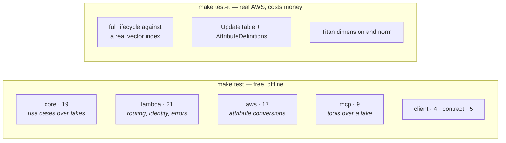

# Testing



**75 unit tests run with no AWS account and no spend.** That is a consequence of
the port design, not of mocking: the driven ports have in-memory
implementations behind the `testing` feature, so the use cases execute for real
against a cosine-scoring fake repository and a deterministic hashing embedder.

Production ships only the Bedrock embedder. The substitute never reaches a
deployed binary.

## What the tests actually protect

The interesting ones are named for the failure they prevent:

| Test | Prevents |
|---|---|
| `a_user_id_in_the_body_is_ignored_rather_than_honoured` | a client addressing another user's memories by editing a payload |
| `two_sso_sessions_of_one_role_reach_the_same_memories` | every SSO login opening a fresh namespace |
| `a_request_without_a_caller_arn_is_rejected` | failing *open* when the integration is misconfigured |
| `max_distance_is_an_upper_bound_not_a_threshold` | inverting the COSINE comparison and returning the junk the caller excluded |
| `stored_vector_is_wrapped_in_a_list_but_the_query_vector_is_not` | the two-shapes trap |
| `recall_rejects_an_out_of_range_top_k_before_paying_for_an_embedding` | paying Bedrock for a request that a hard quota will reject |
| `downstream_failures_are_500s_that_reveal_nothing` | leaking SDK detail into a response body |
| `no_tool_exposes_a_user_id_argument` | handing the model a privilege-escalation argument |
| `every_tool_description_says_when_not_to_call_it` | an agent recalling on every turn, at a cost per turn |
| `the_projection_never_asks_for_the_embedding` | pulling 1024 floats per hit into the billed bytes |
| `a_search_result_without_the_vector_still_rebuilds_a_memory` | deserialisation depending on an attribute the projection omits |

## Integration tests

```bash
export AWS_REGION=us-east-1
make test-it
```

They are `#[ignore]`d **and** gated on `DDB_VECTOR_IT=1`, because they create a
DynamoDB table with a vector index and call Bedrock. Each creates a
randomly-suffixed table and cleans up even on failure.

There is **no local substitute**: `SearchVectors` resolves to a dedicated
endpoint, so DynamoDB Local cannot serve these paths and `endpoint_url`
overrides break search routing. See
[vector-search.md](vector-search.md#gotchas).

### Eventual consistency

Search results lag writes. Asserting immediately after a `PutItem` is a
guaranteed flake, not an occasional one, so the tests poll:

```rust
let hits = recall_until(&service, query, |hits| !hits.is_empty()).await;
```

## Open verifications

Two things need a live AWS account. Both have documented fallbacks, and neither
blocks the code that surrounds it.

### 1. `UpdateTable` with `AttributeDefinitions` and `VectorIndexUpdates`

**Status: request shape confirmed, runtime acceptance pending.**

The Terraform escape hatch has to register the `kind` attribute in the same
`UpdateTable` call that creates the vector index, because
[the provider will not let it be declared on the table](deployment.md#the-vector-index-escape-hatch).
The AWS documentation describes `AttributeDefinitions` only in terms of global
secondary indexes.

Inspecting the SDK source shows `UpdateTableInput` carries both fields, so the
request is valid at the model level:

```
pub attribute_definitions: Option<Vec<AttributeDefinition>>,
pub vector_index_updates:  Option<Vec<VectorIndexUpdate>>,
```

`adding_a_vector_index_can_register_its_search_schema_attribute` settles the
remaining question by creating a table without `kind`, adding the index through
`UpdateTable`, and waiting for it to become searchable.

If it fails, in order of preference:

1. have the script create the whole table with `create-table --vector-indexes`
   and read it back with `data "aws_dynamodb_table"`;
2. drop the `INLINE_FILTER` and filter `kind` client-side.

### 2. `requestContext.identity.userArn` on payload format 1.0

**Status: documented as supported, not yet observed.**

The `$context.identity.*` reference states these variables are "supported for
routes that use IAM authorization", but the sample event in the payload-format
documentation shows the identity fields as `null`.

`make smoke` settles it. The smoke test asserts that the `user_id` echoed back is
**not** the placeholder the client sent, which can only be true if the Lambda
derived it from the principal.

If it fails, in order of preference:

1. parameter mapping of `$context.identity.userArn` into a header with
   `overwrite:` — see [identity.md](identity.md#payload-format-10-is-load-bearing);
2. a Lambda authorizer returning the principal in its `context`;
3. accepting `user_id` in the body — **which stops it being a security
   boundary**, and is a decision to be made explicitly rather than defaulted
   into.

Until then the Lambda **fails closed** with `401`, which is tested.

## Running everything

```bash
make check          # fmt + clippy -D warnings + 75 unit tests
make test-it        # integration, needs AWS_REGION and credentials
make smoke          # end-to-end through the deployed stack
```

`make smoke` is written as a Cargo example rather than a shell script so it
exercises the same SigV4 signing code the MCP server uses — there is no parallel
`awscurl`-style implementation that could disagree with production.
