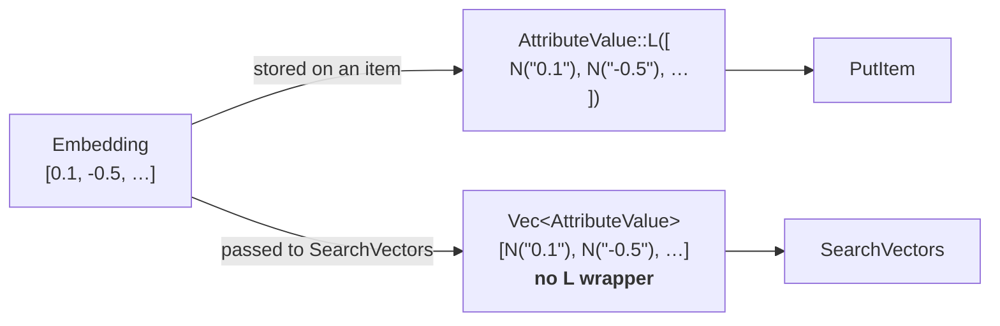

# Working with DynamoDB vector search

DynamoDB gained native vector search on 2026-08-04. In Rust it requires
**`aws-sdk-dynamodb` >= 1.120.0** — earlier releases simply do not have the
`SearchVectors` operation.

## Three API details that decide whether this works

Each of these was a bug waiting to happen. None of them is a type error, and two
of them fail silently.

### 1. A vector has two different shapes



Wrapping the query vector in an `L`, or forgetting the wrapper when storing, is
accepted by the compiler and rejected at runtime. Both conversions live side by
side in `agent-memory-aws/src/attr.rs` so the difference is visible in one
screen:

```rust
/// The vector as STORED on an item: a DynamoDB list (`L`) of numbers (`N`).
pub fn to_item_attr(embedding: &Embedding) -> AttributeValue {
    AttributeValue::L(embedding.as_slice().iter().map(number).collect())
}

/// The vector as SENT to SearchVectors: a flat list, no `L` wrapper.
pub fn to_query_vector(embedding: &Embedding) -> Vec<AttributeValue> {
    embedding.as_slice().iter().map(number).collect()
}
```

Note that `number` is infallible. `Embedding::new` has already rejected NaN and
infinity — values DynamoDB's `N` type cannot represent — so the domain invariant
is what removes the `Result` from this conversion.

### 2. `COSINE` means lower is better

The API returns a field called `Score`, which invites sorting descending. For a
`COSINE` index that is exactly backwards: 0 means identical direction and 2
means opposite.

| Stored vector | Query `[1,0,0,0]` | `COSINE` | Interpretation |
|---|---|---|---|
| `[1, 0, 0, 0]` | identical | `0.0` | best match |
| `[0.7071, 0.7071, 0, 0]` | 45° apart | `0.29` | related |
| `[-1, 0, 0, 0]` | opposite | `2.0` | worst match |

The domain does not expose a score. It exposes `Distance`, whose `Ord` sorts
ascending, so:

- ranking best-first is a plain `sort`, and
- a relevance cutoff is `distance <= max`, which cannot be written the other way
  round without a type error.

Exactly one function in the whole system converts AWS's `Score` into `Distance`,
in the DynamoDB adapter. Switching the index to `DOT_PRODUCT` — where higher is
better and scores can be negative — would be a change to that one function.

### 3. `search_vector()` appends one element per call

```rust
// Wrong: appends a single number to the search vector.
.search_vector(value)

// Right: sets the whole 1024-element vector at once.
.set_search_vector(Some(to_query_vector(&query.embedding)))
```

The singular method compiles and is the one you reach for by name.

## Data model

| Attribute | Type | Role |
|---|---|---|
| `user_id` | S | Table partition key **and** vector index `HASH` |
| `memory_id` | S | Table sort key |
| `kind` | S | `INLINE_FILTER` — `fact`, `preference` or `episode` |
| `text` | S | The memory itself |
| `embedding` | L of N | The vector, 1024 × f32 |
| `created_at` | N | Unix seconds |
| `expires_at` | N | TTL attribute; absent means never expires |
| `source`, `github_login` | S | Provenance and attribution |

Vector index: **`COSINE`**, **1024 dimensions**,
`Projection: INCLUDE [text, created_at, source]`.

Two choices in there are deliberate:

**The projection excludes the embedding.** Only projected attributes can be
returned by `SearchVectors`, and the vector attribute is excluded by default
anyway. Pulling back a 1024-float array on every hit would inflate the response
*and* the billed bytes for nothing. This is also why the domain's `Memory` type
carries no embedding field: there would be no way to populate it from a search
result without paying for it.

**`user_id` is the index partition key and the table primary key.** That single
decision buys per-user search scoping, per-user throughput quotas, the cost
behaviour described in [cost.md](cost.md), and one thing that is easy to
overlook: an item cannot be indexed without its partition key attribute, and
here that attribute *is* the table's primary key. The "silently missing from the
index" failure mode cannot occur.

## f32, not f64

The vector index stores **f32**. Titan returns f64, and the adapter narrows on
the way in rather than on the way out:

```rust
let values: Vec<f32> = values.into_iter().map(|value| value as f32).collect();
```

Storing f64 in the base table would leave the table and the index holding
different numbers for the same memory — a discrepancy that only ever shows up as
slightly wrong rankings.

## Embeddings are never recomputed

DynamoDB does not regenerate a vector when you edit the text beside it. An
update path that writes `text` without rewriting `embedding` leaves the index
answering from stale meaning, silently.

The `remember` use case always re-embeds, and it is the only way to store a
memory, so no code path in this project can produce that state.

## Limits

| Limit | Value |
|---|---|
| Max `TopK` per `SearchVectors` | 100 |
| Max dimensions | 4,096 |
| Vector indexes per table | 5 |
| Inline filters per index | 18 |
| Partition keys (`HASH`) per index | 1 |
| Search rate per partition key value | 1 GBps |
| Write rate per partition key value | 10 MBps |
| Response size (no pagination) | 16 MB |

Note the two throughput quotas are **per partition key value**, which is why
capacity grows with the number of users rather than being shared across them.

## Gotchas

**`SearchVectors` uses a separate endpoint** —
`search-dynamodb.<region>.amazonaws.com`, not the regular DynamoDB one. Three
consequences:

- **DynamoDB Local cannot serve it**, so there is no offline substitute for the
  integration tests.
- Overriding `endpoint_url` breaks search routing rather than helping.
- Inside a VPC that hostname needs its own egress path. The symptom of missing
  it is that writes succeed and *only search* fails, with a connection error
  that does not name the cause. This stack deliberately has no `vpc_config`.

**Waiting for the table is not waiting for the index.**
`aws dynamodb wait table-exists` returns once `TableStatus` is `ACTIVE`, which
happens while the index is still `CREATING`. Worse, an index added to an
existing table reports `ACTIVE` *before* backfill finishes, and `SearchVectors`
errors during backfill. Both conditions must hold:

```
IndexStatus == ACTIVE  &&  Backfilling != true
```

There is no AWS waiter for this. `admin::wait_until_searchable` and
`terraform/scripts/vector-index.sh` both poll for it.

**Other constraints:**

- Vector indexes require **on-demand capacity**; a `PROVISIONED` table is
  rejected outright.
- Search results are **eventually consistent**. Asserting immediately after a
  write is a guaranteed flake, not an occasional one.
- No `Query`, `Scan` or PartiQL against a vector index, and no pagination.
- DAX does not support `SearchVectors`.
- The index's `ItemCount` and `IndexSizeBytes` update roughly every six hours —
  do not use them to confirm a load.
